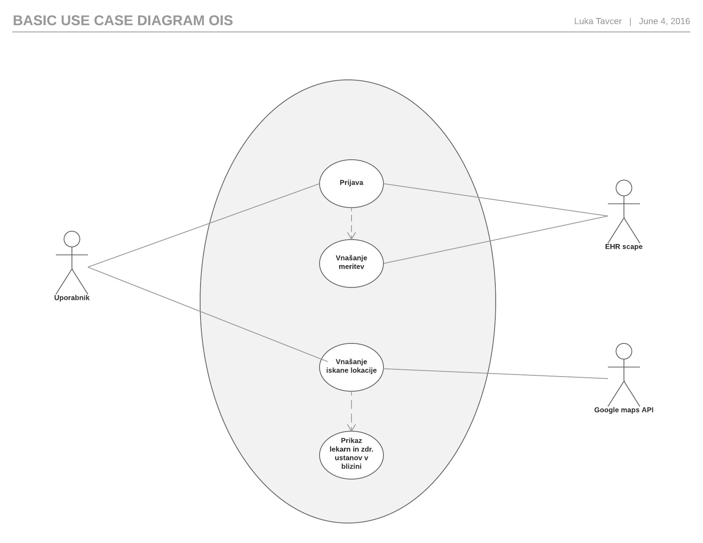
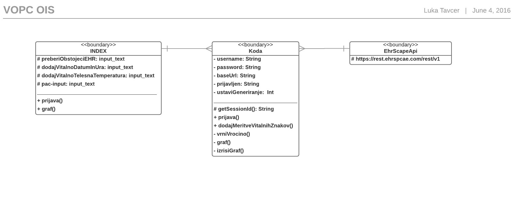
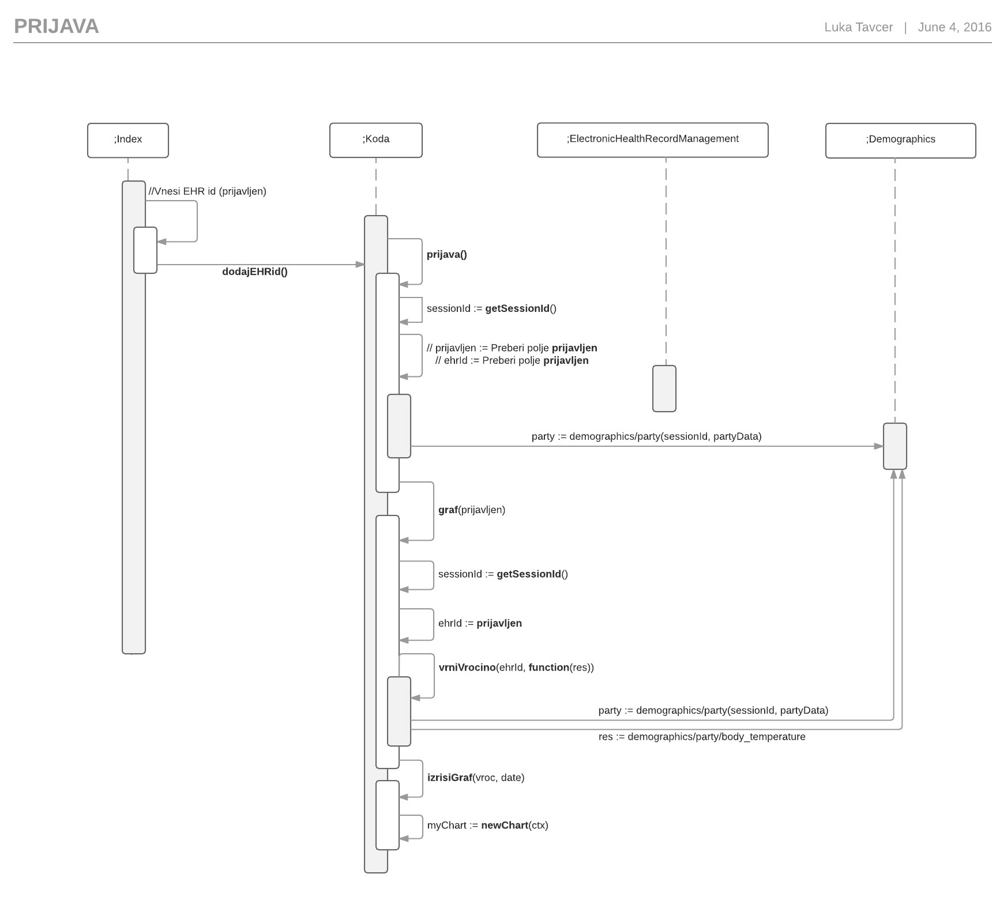

# Spletna aplikacija eZdravje
Spletna aplikacija eZdravje + EHRscape API + Google maps API

  http://lukat33.github.io/eZdravje/index.html

## Ideja
Aplikacija je namenjena vsem, ki si želijo beležiti svojo ali bolnikovo telesno temperaturo. Tudi tistim, ki ne vedo pri kateri temperaturi govorimo o vročini ali podhladitvi. Aplikacija ima graf, ki jim to nazorno pokaže. Na voljo imajo tudi pripomoček (google maps), ki jim olajša iskanje, ter jim samodejno označi zdravstvene ustanove ali lekarne v bližini iskane lokacije. Vsebuje tudi navodila za uporabo, ki pojasnijo kako se aplikacija uporablja.

### Uporabljeni zunanji viri podatkov
Aplikacija uporablja Google maps API. Uporablja se kot neposredni API klic. Olajša iskanje, ter samodejno označi zdravstvene ustanove ali lekarne v bližini iskane lokacije.

### Master/detail načrtovalski vzorec
Uporabljen kot poučno besedilo o vročini, ki se izpiše ob izbiri.

### Tehnika za vizualizacijo podatkov
Za vizualizacijo podatkov se uporablja knjiznica Chart.js. Uporabljena je, ker zelo lepo prikaže določene podatke in je relativno enostavna za uporabo (odlična dokumentacija).

## Načtrt informacijske rešitve

### Diagram primerov uporabe

### VOPC diagram

### Diagram zaporedja
